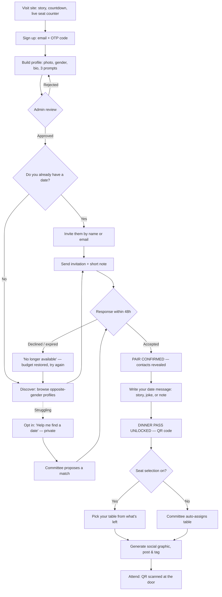

# PRD — FYB Dinner Night (CACCF)

## Context

CACCF is running an FYB Dinner Night. The organising committee wants registration to stop being paperwork and start being part of the event itself.

The governing rule is **"No date, no dinner."** Nobody attends alone. You either bring a date you already have, or you find one through the site. Registration is not complete until you are paired.

That single rule is the whole product. It converts a form into a game: you have to act, someone else has to act back, and only then do you get your pass. It creates weeks of pre-event conversation, natural social-media spread, and — as a side effect — gives the planning and decoration teams an exact, confirmed headcount and seating map instead of a guess.

The site must also do the unglamorous work: approve profiles, moderate content, assign tables, print table cards, and check people in at the door.

**Confirmed decisions (from committee):**

| Decision | Choice |
|---|---|
| Pairing rule | Male–female only, enforced in the database |
| Unpaired attendees | Private admin matchmaker queue |
| Ticket fee | Free event — no payment integration |
| Expected scale | 100–300 attendees (~50–150 pairs, ~15–30 tables) |

**Non-goals for v1:** no payments, no open chat/DM system, no native mobile app, no public profile browsing without login, no post-event photo gallery.

---

## The core insight (and the risk)

The concept borrows from dating apps, and dating apps have a known failure mode: a visible market where some people get lots of attention and others get none. In a church, that failure mode is not a metric — it's a person sitting at home on the night because nobody asked them.

Three design rules protect against it. They are requirements, not nice-to-haves.

1. **Declines are private and softly worded.** The sender is told *"— is no longer available"*, never *"— declined you."* No rejection counts are stored on a profile or shown anywhere.
2. **Scarcity is applied to the sender, not the receiver.** Each person gets a small budget of invitations and only **one outstanding at a time**. This makes an invitation feel considered rather than mass-mailed, and it structurally prevents one popular person from absorbing fifty requests.
3. **The matchmaker queue is the safety net.** A private *"Help me find a date"* toggle, visible only to admins. The committee pairs people manually before the deadline, and the resulting invitation is framed as *"The FYB committee thinks you two would make a great table"* — so neither person is the one who had to ask, and neither is the one nobody asked.

There is also a safety dimension. This is a church directory of young people with photos. So: **no phone numbers or socials until paired**, **admin approves every profile before it goes live**, **no free-form messaging except the single date message**, and a **report/block button on every profile**. Shipping an unmoderated DM system here would be a mistake.

---

## User flow



Changes from the committee's original sketch: an **admin approval gate** after profile creation, an explicit **decline → retry loop** (the original flow assumed acceptance), the **matchmaker branch** feeding back into the same invitation pipeline, and **table assignment as a fork** rather than a fixed step so seat selection can be switched off without changing the flow.

---

## Features

### F1 — Public landing page
The sales pitch. Event story, date/time/venue, how the "no date, no dinner" rule works in three panels, countdown timer, and a **live stats bar**: `142 registered · 58 pairs confirmed · 34 seats left`. Live numbers are the single strongest conversion driver — they make hesitation expensive.

Also: FAQ (including "what if I can't find a date?" answered warmly), a consented **wall of confirmed pairs**, and a carousel of the best public date messages. Full mobile-first; most traffic will arrive from a WhatsApp link.

### F2 — Accounts
Supabase Auth, **email + 6-digit OTP code**. Chosen over magic links because magic links break when a phone opens them in an in-app browser different from the one that started the flow — a real and common failure on WhatsApp-shared links. Phone number is collected on the profile for committee contact, not used for login (SMS costs money and adds a vendor).

### F3 — Profile
Required: first name, surname, gender, phone, one photo. Optional: department/unit, level, a 140-character bio, and **three prompt answers** chosen from a set — *"My ideal table conversation is…"*, *"The one song that will get me on the floor…"*, *"I'm the friend who always…"*.

The prompts matter. They shift discovery away from ranking people by photo and toward picking someone whose answers made you laugh, which is both healthier and much more appropriate here. Photos are stored via Cloudinary with a face-aware square crop.

Every profile enters `pending_review`. An admin approves or rejects with a reason before it appears in discovery. At this scale that is a few minutes of work a day.

### F4 — Discovery
A card grid of **approved, unpaired, opposite-gender** profiles. Shows photo, first name + last initial, department, and prompt answers. Hides phone, email, surname, and socials until paired.

Filters by department and level. Sort defaults to **least-invited first**, not newest — this quietly spreads attention across everyone instead of letting the first few profiles dominate. Search by name for people looking for someone specific. Report and block on every card.

### F5 — Invitations (the engine)
Send an invitation with a required short note (max 200 chars) — a note costs effort, and effort is what makes the invitation feel real.

**Rules, all admin-configurable:**

| Rule | Default | Why |
|---|---|---|
| Outstanding invitations | 1 at a time | Forces intentionality; eliminates double-accept races |
| Lifetime invitations sent | 5 | Makes each one count without trapping anyone |
| Expiry | 48 hours | Nobody is left hanging; frees both sides automatically |
| Invitations received | Unlimited | Never punish someone for being popular |
| Withdraw | Any time | Restores the slot, does not refund the lifetime count |

Declining is free, private, and unlimited. An expired or withdrawn invitation **refunds** the lifetime count; a decline does not.

**"I already have a date":** invite by name search or by email address. If they have not registered, the site sends them an invitation email with a signup link that carries the pending invitation through to their new account.

### F6 — Pairing
Acceptance is the critical transaction and the most likely source of bugs. When someone with three pending invitations accepts one, the system must — **atomically, in a single Postgres function with row locks** — re-verify both people are unpaired, re-verify the gender rule, create the pair, void every other pending invitation for both people, refund those senders' budgets, and issue the pass. Doing this in application code will eventually double-pair somebody.

On confirmation: both see a celebration screen, contact details are revealed to each other, and both drop out of discovery.

**Dissolving a pair** is admin-only (people fall ill, plans change). It returns both to unpaired, frees the table seats, and revokes the pass.

### F7 — Date message
Once paired, each person writes one message to their date — a note, a joke, a short story. The recipient sees it immediately and privately.

An explicit, unticked checkbox: *"The committee may share this publicly (names hidden if you prefer)."* Only consented, admin-approved messages ever reach social media. Every message is profanity-filtered and visible to admins. **This is the only free-text channel between two people in the entire product** — a deliberate constraint that removes almost all moderation risk.

### F8 — Dinner pass
Issued on pairing. Shows both names, table number (once assigned), event details, and a **QR code carrying a signed token**. Downloadable as PNG and PDF, and it renders as a shareable web page.

### F9 — Tables & seating
Tables have a label, capacity (typically 8 or 10 — 4 or 5 pairs), and a zone. **A pair is the unit of seating and is never split.**

Two modes behind an admin toggle:
- **Self-select** — the pair picks from open tables. Either member can claim; the other is notified. Claiming is capacity-checked in a transaction so two pairs cannot take the last slot at once.
- **Auto-assign** — the committee assigns, optionally clustering by department or deliberately mixing.

Scarcity is surfaced everywhere: *"Only 30 seats remaining"*, *"Table 2 is almost full."* The toggle exists because the committee may decide mid-campaign that self-selection is hurting the room layout — flipping it must not require a code change.

### F10 — Social graphic
Rendered **client-side on a canvas**, so it costs nothing to run and works instantly. The user's photo drops into a branded template.

Templates: *"I'm attending the FYB Dinner Night"*, *"I found my date for the FYB Dinner Night 😂"*, and a **two-photo pair card**. Output in 1080×1080 (feed) and 1080×1920 (status/story). Download, native share sheet, and a pre-filled caption with the handle and hashtag ready to paste. Shared links also generate dynamic OG preview images so they look designed in a WhatsApp chat rather than like a bare URL.

### F11 — Admin dashboard
The committee's workspace: profile approval queue, moderation queue (reports, flagged messages), **matchmaker queue** with a one-click "propose match", drag-and-drop table board, and exports — attendee CSV, printable table cards, printable seating chart.

Config panel with no deploy required: registration open/closed, discovery open/closed, seat selection on/off, invite caps, expiry window, pairing deadline, total seats, event details. Plus a **door check-in scanner** page that reads the QR and marks each person present.

Every admin action is written to an audit log. Admins can see private messages; a record of who looked at what protects both the committee and its members.

---

## Reference sites

**For the event page and overall polish — [Luma](https://lu.ma)**. The current benchmark for event pages: restrained type, generous spacing, dark mode, an unfussy RSVP flow, and a "who's coming" grid that does real social-proof work. Study its event page and guest list layout.

**For tone and mobile behaviour — [Partiful](https://partiful.com)**. Mobile-first, playful, aimed at a young audience, built around a link you paste into a group chat — which is exactly how this event will spread. Study how it makes a guest list feel like an occasion rather than a spreadsheet.

**For the discovery UI — [Hinge](https://hinge.co)**. The important reference. Hinge is prompt-led rather than swipe-led: you respond to something specific a person wrote. That model is both a better fit for a church and a better fit for an event where the point is who you will enjoy talking to over dinner. Take the prompt-answer card layout; take nothing from swipe mechanics.

**For the invitation budget — [Coffee Meets Bagel](https://coffeemeetsbagel.com)**. Deliberately limited daily options as a feature. Useful precedent for framing the 5-invitation cap as *"make it count"* rather than *"you are being restricted."*

**For seating tools — [RSVPify](https://rsvpify.com) and [Withjoy](https://withjoy.com/wedding-website/)**. Both are mature at exactly the boring parts: seating chart builders, group RSVPs, meal selections, and guest management. Withjoy is also a good model for matching the website's visual language to the printed invitation.

**For the shareable graphic — Next.js Conf and Contentful "Fast Forward" ticket pages** ([pattern write-up](https://dev.to/whitep4nth3r/how-to-build-a-personalized-image-social-sharing-app-with-cloudinary-and-next-js-2640)). Each attendee gets a personalised ticket image built for posting. This is precisely the F10 mechanic, already proven at conference scale. **Spotify Wrapped** is the reference for share-card composition: one big number, one bold statement, unmistakable branding.

**For seat map rendering** — [SeatchartJS](https://github.com/seatchart/seatchart) (MIT, dependency-free), [Konva](https://konvajs.org) with React bindings for a custom canvas board, or [Seats.io](https://github.com/seatsio/seatsio-react) if you would rather buy than build. At 15–30 round tables a simple CSS-grid board is likely enough; reach for these only if the venue layout is irregular.

---

## Technical approach

### Stack
**Next.js 15 (App Router) + TypeScript + Tailwind + shadcn/ui + framer-motion**, deployed on Vercel, with **Supabase** for auth, Postgres, storage, and realtime, and **Cloudinary** for photo transforms. TanStack Query for client data, `sonner` for toasts, `zod` for validation, `jspdf` for pass and table-card PDFs.

Next.js over a Vite SPA specifically because of `next/og` for dynamic share previews, real SEO on the public landing page, and server actions that remove the need for a separate API service. It is one deployable instead of two, which matters for a volunteer-run project on a deadline. This mirrors `EaseinbizSaaSNext`; the Supabase, Cloudinary, and shadcn patterns carry over directly from `Easeinbiz-web`.

### Schema

```
profiles          id→auth.users, first_name, last_name, gender, phone, email,
                  photo_url, bio, prompts jsonb, department, level,
                  review_status, pairing_status, invites_sent_count,
                  seeking_help, is_blocked, is_admin

invitations       id, sender_id, recipient_id, note, status, source(user|matchmaker),
                  expires_at, responded_at, created_at

pairs             id, user_a_id, user_b_id, status, table_id, confirmed_at,
                  dissolved_at, dissolved_reason

date_messages     id, pair_id, author_id, body, share_consent,
                  moderation_status, created_at

tables            id, label, capacity, zone, is_open, notes

passes            id, pair_id, code, qr_token, issued_at,
                  checked_in_a_at, checked_in_b_at

reports           id, reporter_id, reported_id, reason, notes, status

event_config      single row — all toggles, caps, deadlines, event details

audit_log         id, actor_id, action, target_type, target_id, payload, created_at
```

### Rules live in the database, not the UI
Every invariant is enforced by a `SECURITY DEFINER` Postgres function plus RLS. The UI is a convenience layer; anyone with the anon key can call the API directly, so the gender rule, the invitation caps, and the pairing atomicity must hold at the database boundary.

- `send_invitation(recipient_id, note)` — checks gender rule, both unpaired, caps not exceeded, no existing outstanding invite
- `respond_to_invitation(invitation_id, accept)` — the atomic transaction described in F6, with `SELECT … FOR UPDATE` on both profile rows
- `claim_table(pair_id, table_id)` — capacity check and claim in one transaction
- `dissolve_pair(pair_id, reason)` — admin only; unwinds pair, seats, and pass

**RLS shape:** you read your own profile fully; you read other profiles only if approved, unpaired, and opposite-gender, and only through a view that omits contact fields; contact fields unlock only for your confirmed partner; admins bypass via an `is_admin` claim. Realtime channels carry only aggregate counters — never profile rows — so live stats cannot leak the directory.

---

## Build phases

| Phase | Scope | Effort |
|---|---|---|
| **0 — Foundation** | Repo, Supabase project, full schema, RLS policies, design system and tokens, seed data | 2–3 days |
| **1 — Front door** | Landing page, countdown, live stats, email OTP auth, profile builder, Cloudinary upload, admin approval queue | 4–5 days |
| **2 — The engine** | Discovery grid with filters, invitation send/respond/withdraw/expire, the atomic pairing transaction, matchmaker queue, report and block | 5–7 days |
| **3 — The payoff** | Date messages with consent and moderation, dinner pass, QR generation, PNG/PDF export, social graphic canvas, OG images | 4–5 days |
| **4 — The room** | Tables schema and board, self-select and auto-assign modes, live seat counters, admin table drag-and-drop, CSV and table-card exports | 4–5 days |
| **5 — Door and polish** | QR check-in scanner, notification emails, audit log views, accessibility pass, load test at 300 profiles, content freeze | 3–4 days |

Roughly **4–5 weeks** at a steady pace. Phases 0–2 are the critical path — the pairing engine is the product, and everything after it is presentation. If the event date is tight, ship 0–3 and run tables manually from a CSV export; Phase 4 is the first thing that can safely be cut.

**Invitation expiry** runs as a Supabase scheduled function (`pg_cron`) every 15 minutes, expiring stale invitations and refunding sender budgets.

---

## Success criteria

- **≥ 85%** of approved profiles reach confirmed-pair status by the deadline
- **Zero** attendees left unpaired without the committee having personally reached out
- **Zero** double-pairings or over-capacity tables in production
- **≥ 40%** of paired attendees download a social graphic
- Committee can produce a final seating chart and table cards **in under 10 minutes**
- Door check-in averages **under 10 seconds** per pair

---

## Verification

**Pairing engine (the part that must not break):**
- Concurrency test — script 3 people sending invitations to the same person, all accepted within milliseconds. Exactly one pair must form; the other two invitations must be voided and their budgets refunded.
- Attempt a same-gender pairing by calling the RPC directly with a raw Supabase client, bypassing the UI. Must be rejected by the database.
- Exhaust the 5-invitation budget; confirm the 6th is refused and that expiry refunds a slot while a decline does not.
- Let an invitation expire past 48 hours; confirm `pg_cron` releases both sides.

**Privacy:**
- With a plain anon-key client, attempt to select another user's `phone` and `email`. Must return null or error under RLS.
- Confirm a `pending_review` profile is invisible in discovery.
- Confirm same-gender profiles never appear in the discovery query.

**Seating:**
- Two pairs claim the last slot at one table simultaneously — exactly one succeeds.
- Dissolve a seated pair; confirm seats are released and the counter corrects.

**End-to-end rehearsal before launch:** seed 300 realistic profiles, run a full committee walkthrough — register, get approved, invite, decline, re-invite, accept, message, claim a table, download the pass and graphic, then scan the QR at a mock door. Time the seating export. Run the site through Lighthouse on a throttled mobile connection, since that is how nearly everyone will actually use it.

---

## Open items for the committee

1. **Event date** — sets the pairing deadline and all phase dates.
2. **Invitation caps** — 5 lifetime / 1 outstanding is the recommended default; confirm or adjust.
3. **Table size** — 8 or 10 seats determines the table count.
4. **Photo policy** — is a photo required to appear in discovery, or is a placeholder acceptable for those who would rather not post one?
5. **Who moderates** — profile approval needs a named person with a daily turnaround commitment, or the queue becomes the bottleneck.
6. **Branding** — logo, colours, and fonts, needed before Phase 0 design tokens.

---

*Once this is approved I can also publish it as a shareable web page for the committee to read and comment on, rather than passing a markdown file around.*
